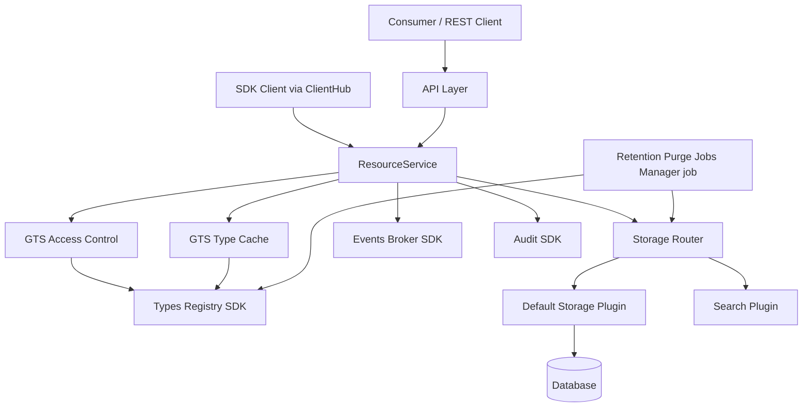
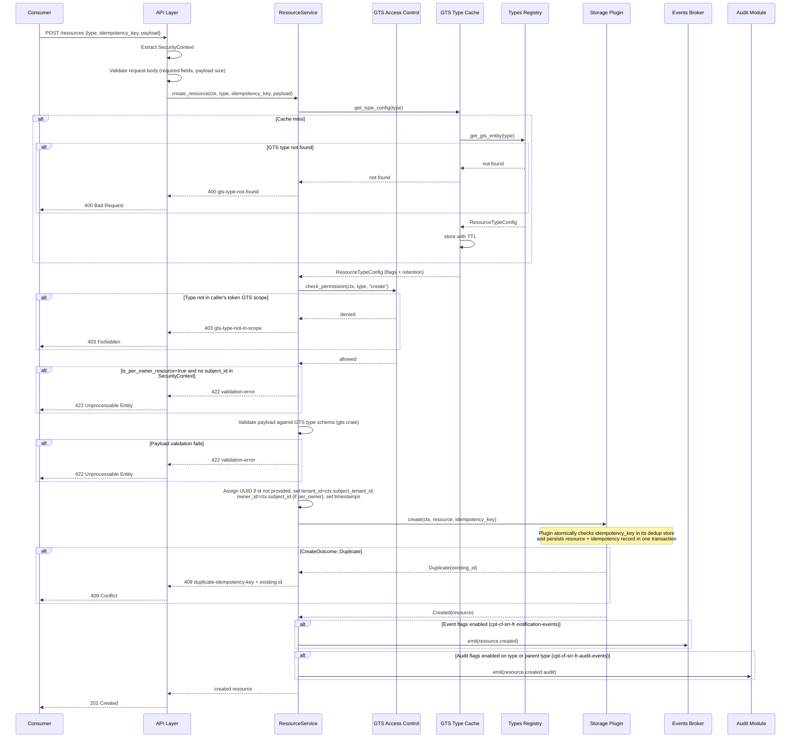
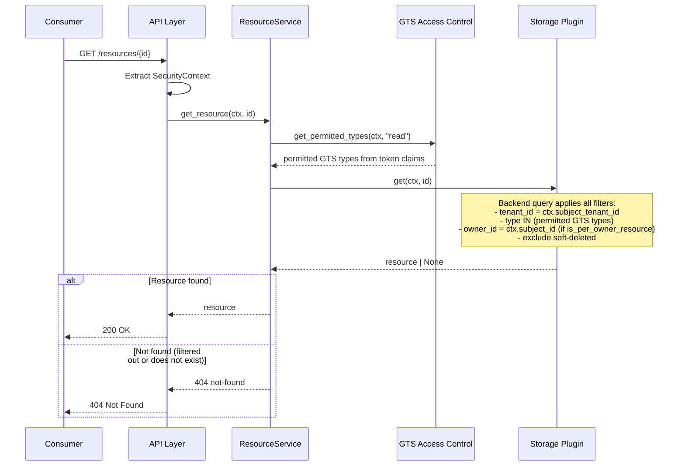
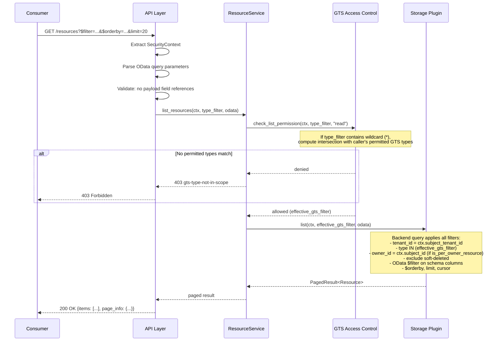
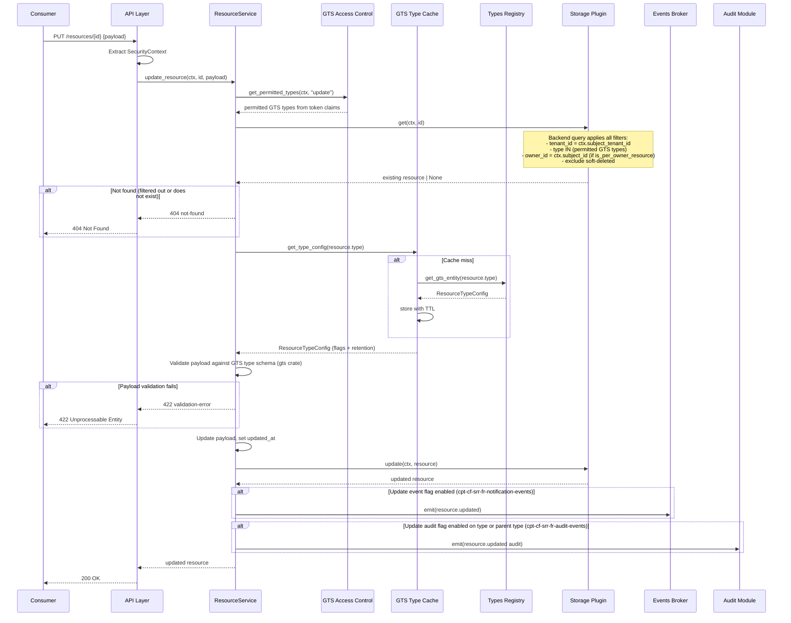
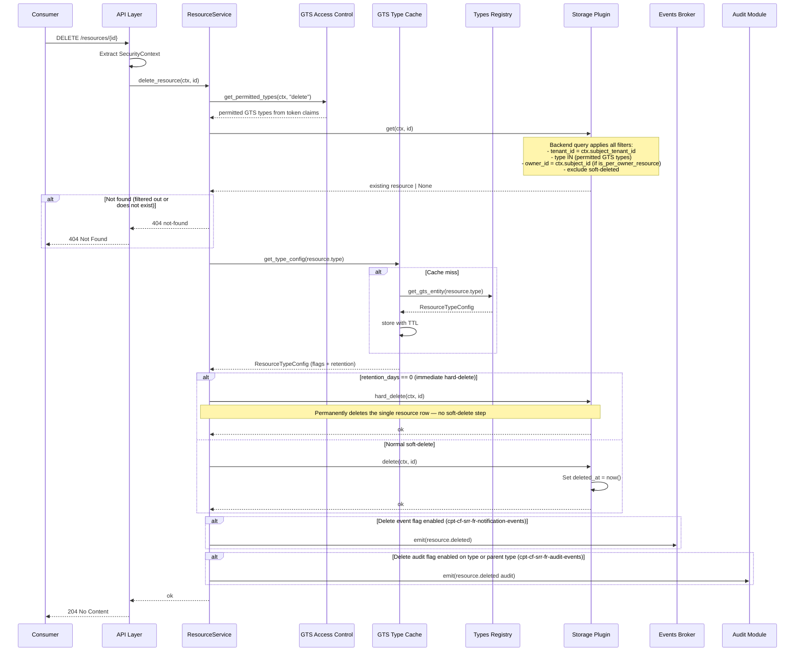
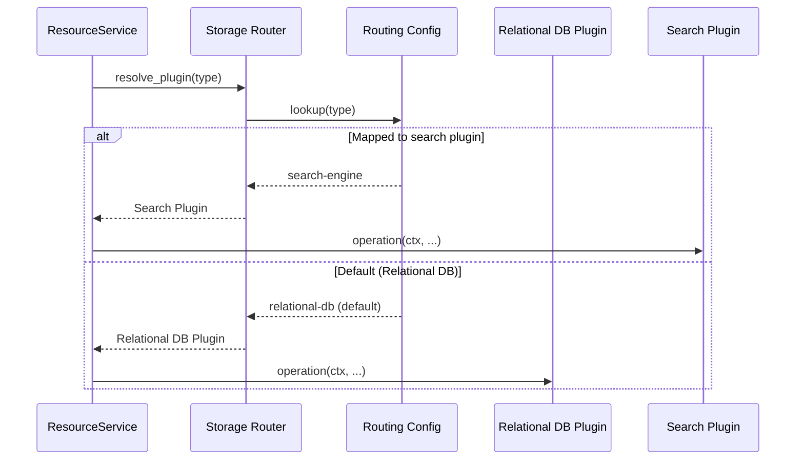
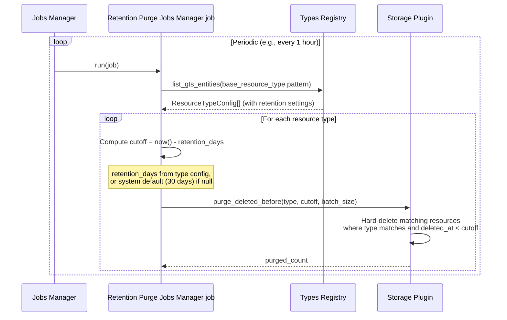

# Technical Design — Simple Resource Registry

## 1. Architecture Overview

### 1.1 Architectural Vision

Simple Resource Registry follows a layered architecture with a pluggable storage backend. The module exposes a single REST API surface for CRUD operations on typed resources. All resources share a common schema envelope (identity, ownership, timestamps) and an opaque JSON payload. Schema envelope fields are queryable via OData; payload content is opaque and not queryable.

The resource `type` field contains the resource's GTS type identifier in GTS ID format. In other words, the resource `type` value is the same identifier as the resource's GTS type ID (GTS type ID).

The storage layer is abstracted behind a `ResourceStoragePluginClient` trait, allowing the same API to serve different backends. The default implementation is a relational backend (`cpt-cf-srr-fr-default-storage-backend`) described in the [plugin DESIGN](../plugins/srr-rdb-plugin/docs/DESIGN.md). The interface is intentionally minimal: the core module handles authentication, authorization, GTS type resolution, and event/audit emission, while backends handle persistence and query execution. Multiple backends can coexist with per-resource-type routing.

Resource type definitions are managed through GTS (Global Type System) via the Types Registry module. A base GTS schema defines the common envelope and behavioral flags (event/audit configuration). Derived types extend the base schema with type-specific payload definitions. This approach enables runtime discoverability of registered resource types and decouples type definition from storage implementation.

### 1.2 Architecture Drivers

#### Functional Drivers

| Requirement | Design Response |
| --- | --- |
| `cpt-cf-srr-fr-create-resource` | API layer extracts tenant/user from SecurityContext; domain layer assigns UUID and timestamps; delegates to storage plugin |
| `cpt-cf-srr-fr-read-resource` | ResourceService resolves permitted GTS types, then storage plugin applies backend-level filters (tenant, type scope, owner_id for per-user types); returns 404 when no match found |
| `cpt-cf-srr-fr-list-resources` | OData parser translates query params to backend query filters on schema columns; plugin executes scoped query |
| `cpt-cf-srr-fr-update-resource` | ResourceService resolves permitted GTS types, storage plugin fetches target resource with backend-level security filters, then domain layer validates payload and updates `updated_at` |
| `cpt-cf-srr-fr-delete-resource` | Soft-delete via deleted_at timestamp; storage plugin filters soft-deleted records from list queries |
| `cpt-cf-srr-fr-gts-type-registration` | Base GTS schema registered at module startup; derived types registered by consumer modules via Types Registry SDK |
| `cpt-cf-srr-fr-default-storage-backend` | Default relational DB backend implemented as a separate plugin module (`srr-rdb-plugin`); declares `odata_support` capability |
| `cpt-cf-srr-nfr-scalability` | 100M resources / 100 writes·s⁻¹ / 1000 reads-by-ID·s⁻¹ — achieved via proper indexing in the default backend; storage optimization is a per-backend concern |
| `cpt-cf-srr-fr-odata-schema-fields` | OData $filter/$orderby limited to schema columns; cursor-based pagination (limit, cursor); payload column excluded from query support |
| `cpt-cf-srr-fr-gts-access-control` | ResourceService checks caller `Permission` entries (`resource_pattern` + action). Returns 403 for pre-query denials (POST, LIST no-intersection). For individual resources (GET/PUT/DELETE), permissions are enforced via backend query filters and unmatched scope results in 404 |
| `cpt-cf-srr-fr-gts-wildcard-filtering` | GET list accepts GTS wildcard in `type` filter (trailing `*`); uses `GtsWildcard::new()` + `gts_id.wildcard_match()` for matching; results intersected with caller's permitted GTS types |
| `cpt-cf-srr-fr-gts-type-validation` | ResourceService calls Types Registry SDK to verify GTS type existence; returns 400 `gts-type-not-found` if missing |
| `cpt-cf-srr-fr-deleted-retention` | Jobs Manager job permanently removes resources where `deleted_at + deleted_resource_retention_days < now()` for soft-deleted resources |
| `cpt-cf-srr-fr-notification-events` | Domain layer checks GTS type behavioral flags; emits fixed-schema events (id, type, subject_type, subject_id) via Events Broker SDK when enabled |
| `cpt-cf-srr-fr-audit-events` | Domain layer checks GTS type audit flags (including inherited flags from parent GTS types); emits fixed-schema audit events (id, type, subject_type, subject_id, previous_payload, new_payload) via Audit SDK when enabled |
| `cpt-cf-srr-fr-multi-backend-storage` | `ResourceStoragePluginClient` trait enables additional backends including vendor-provided plugins for existing platform storage; GTS-based plugin discovery and scoped ClientHub clients per ModKit plugin pattern |
| `cpt-cf-srr-fr-storage-routing` | Configuration maps GTS type IDs to storage plugin instances; router resolves plugin per request |
| `cpt-cf-srr-fr-batch-operations` | Batch endpoints (POST /resources:batch, POST /resources:batch-get) delegate per-item to ResourceService with shared SecurityContext; 207 Multi-Status with per-item results per DNA BATCH.md; configurable batch size cap |
| `cpt-cf-srr-fr-resource-groups` | Many-to-many group membership model; group-level batch operations (list, delete); group lifecycle |
| `cpt-cf-srr-fr-idempotent-create` | POST requires `idempotency_key`; plugin atomically checks and persists the key+resource in one transaction; `CreateOutcome::Duplicate` returned for duplicate key within retention window → 409 with existing resource id |

#### ADR Drivers

| ADR | Decision Summary |
| --- | --- |
| `cpt-cf-srr-adr-plugin-storage` | Plugin-based multi-backend storage architecture — trait-based plugin interface with GTS-based discovery; enables vendor extensibility and multi-backend coexistence |
| `cpt-cf-srr-adr-db-security-filtering` | DB-level security filtering — tenant, owner, and GTS type scope enforced as query predicates (404 for filtered-out resources); 403 reserved for pre-query type-scope denials |
| `cpt-cf-srr-adr-search-strategy` | Search is backend capability-driven (`search_support`) and enabled per resource type via routing; 501 when unsupported |

#### NFR Allocation

| NFR ID | NFR Summary | Allocated To | Design Response | Verification Approach |
| --- | --- | --- | --- | --- |
| `cpt-cf-srr-nfr-read-latency` | Single-resource GET < 50ms p95 | Storage Backend, Database | ID-based lookup with tenant scoping; backend-internal indexing; connection pooling; ResourceTypeConfig (behavioral flags + retention) cached in-process using `Arc<RwLock<HashMap<String, ResourceTypeConfig>>>` to avoid repeated Types Registry SDK round-trips per request | Load test with p95 measurement |
| `cpt-cf-srr-nfr-payload-size` | Payload ≤ 64 KB | API Layer | Request body size validation before deserialization | Unit test with oversized payloads |
| `cpt-cf-srr-nfr-scalability` | 100M resources; 100 writes/s; 1000 reads-by-ID/s | Storage Backend | Proper indexing on schema fields; storage optimization is backend-internal | Load test with sustained throughput measurement |

### 1.3 Architecture Layers

```text
┌──────────────────────────────────────────────────────────┐
│                   API Layer                              │
│   REST endpoints, OpenAPI, request validation            │
├──────────────────────────────────────────────────────────┤
│                Application Layer                         │
│   ResourceService: orchestration, auth, events           │
├──────────────────────────────────────────────────────────┤
│                 Domain Layer                             │
│   Resource entity, GTS type resolution,                  │
│   behavioral flags, storage plugin trait                 │
├──────────────────────────────────────────────────────────┤
│              Infrastructure Layer                        │
│   Default Storage Plugin │ Future plugins                │
│   Events Broker SDK │ Audit SDK │ Types Registry         │
└──────────────────────────────────────────────────────────┘
```

| Layer | Responsibility | Technology |
| --- | --- | --- |
| API | REST endpoints, request/response serialization, OData query parsing, OpenAPI spec | modkit REST, OpenAPI 3.0 |
| Application | Request orchestration, SecurityContext propagation, GTS type resolution, event/audit emission | Rust async services |
| Domain | Resource entity model, storage plugin trait definition, behavioral flag evaluation | Rust traits, GTS schemas |
| Infrastructure | Storage implementations, external module SDK clients | Storage Plugin(s), Events Broker SDK, Audit SDK, Types Registry SDK |

## 2. Principles & Constraints

### 2.1 Design Principles

#### Schema-Payload Separation

- [ ] `p1` - **ID**: `cpt-cf-srr-principle-schema-payload-separation`

All resources share fixed schema columns (id, tenant_id, owner_id, type, timestamps) and an opaque payload column. Schema columns are indexed and queryable via OData. Payload is stored and returned as-is without indexing or query support.

This principle keeps the storage model simple and avoids per-type table proliferation while still enabling meaningful filtering on structural fields.

#### Plugin Isolation

- [ ] `p1` - **ID**: `cpt-cf-srr-principle-plugin-isolation`

**ADRs**: `cpt-cf-srr-adr-plugin-storage`

Storage plugins implement only persistence and query execution. They receive already-validated, already-authorized requests from the domain layer. Plugins do not perform authentication, authorization, GTS type resolution, or event emission. This keeps plugin implementations thin and ensures security logic is centralized. The trait is designed so that platform vendors can implement custom plugins to bridge the registry API to existing platform storage components, allowing the registry to act as a unified façade without requiring data migration.

#### GTS-First Type System

- [ ] `p1` - **ID**: `cpt-cf-srr-principle-gts-first`

All resource types are defined and registered through GTS. The base resource type and derived types use GTS schema inheritance. Type behavioral flags (event/audit configuration) are stored in the GTS type definition, not in module configuration. This ensures type metadata is discoverable, versionable, and consistent across the platform.

### 2.2 Constraints

#### Backend-Internal Storage Model

- [ ] `p1` - **ID**: `cpt-cf-srr-constraint-backend-internal-storage`

Storage layout and optimization (table design, indexing, partitioning) are backend-internal concerns. The main module defines a **canonical reference schema** (see §3.8) as the recommended starting point for relational backends — this ensures predictable performance, easier plugin implementations, and consistent migrations. Non-relational backends may use any internal data structure appropriate to their storage technology. For resource types requiring specialized storage (full-text search, dedicated indexing), per-resource-type routing (`cpt-cf-srr-fr-multi-backend-storage`) enables alternative backends.

#### No Payload Querying

- [ ] `p1` - **ID**: `cpt-cf-srr-constraint-no-payload-query`

OData queries cannot target payload fields. Consumers requiring payload-level queries must either promote frequently queried fields to the schema level (by extending the module) or use search-capable storage backends (`cpt-cf-srr-fr-search-api`). This constraint is a deliberate trade-off for simplicity and predictable performance.

#### Soft-Delete with Configurable Retention Purge

- [ ] `p1` - **ID**: `cpt-cf-srr-constraint-soft-delete`

Resources are soft-deleted via the API (deleted_at timestamp set). Soft-deleted resources are permanently purged by a Jobs Manager job after a configurable retention period (default 30 days, overridable per resource type via GTS type definition). The module does **not** support automatic soft-deletion of active resources based on a TTL — this is intentionally excluded as error-prone.

#### Payload Size Limit

- [ ] `p1` - **ID**: `cpt-cf-srr-constraint-payload-size`

Resource payloads are limited to 64 KB. This prevents storage abuse and ensures predictable query performance. Consumers needing to store large binary data should use File Storage and reference files by URL in the payload.

## 3. Technical Architecture

### 3.1 Domain Model

**Technology**: GTS (JSON Schema), Rust structs

**Core Entities**:

| Entity | Description |
| --- | --- |
| Resource | A stored object with schema envelope + JSON payload |
| ResourceType | GTS type definition containing behavioral flags and payload schema |
| BaseResourceType | The GTS base schema shared by all resource types |

**Base Resource Type GTS Schema** (major-version-only):

Behavioral flags (event/audit configuration, user-scoping, retention) are defined as **GTS schema traits** via `x-gts-traits-schema` per GTS spec §9.7. Traits are not part of the instance data model — they configure cross-cutting system behavior. Derived resource types provide concrete trait values via `x-gts-traits`.

```json
{
  "$id": "gts://gts.x.core.srr.resource.v1~",
  "$schema": "https://json-schema.org/draft/2020-12/schema",
  "title": "SimpleResource",
  "type": "object",
  "x-gts-traits-schema": {
    "type": "object",
    "additionalProperties": false,
    "properties": {
      "is_per_owner_resource": {
        "type": "boolean",
        "default": false,
        "description": "When true, resources of this type are user-scoped (owner_id is set from SecurityContext)."
      },
      "is_create_event_needed": {
        "type": "boolean",
        "default": false,
        "description": "Emit a notification event on resource creation."
      },
      "is_update_event_needed": {
        "type": "boolean",
        "default": false,
        "description": "Emit a notification event on resource update."
      },
      "is_delete_event_needed": {
        "type": "boolean",
        "default": false,
        "description": "Emit a notification event on resource deletion."
      },
      "is_create_audit_event_needed": {
        "type": "boolean",
        "default": false,
        "description": "Emit an audit event on resource creation."
      },
      "is_update_audit_event_needed": {
        "type": "boolean",
        "default": false,
        "description": "Emit an audit event on resource update."
      },
      "is_delete_audit_event_needed": {
        "type": "boolean",
        "default": false,
        "description": "Emit an audit event on resource deletion."
      },
      "deleted_resource_retention_days": {
        "type": ["integer", "null"],
        "minimum": 0,
        "default": null,
        "description": "Days to retain soft-deleted resources before purge. null = system default (30 days). 0 = immediate hard-delete."
      }
    }
  },
  "properties": {
    "id": { "type": "string", "format": "uuid" },
    "type": { "type": "string" },
    "tenant_id": { "type": "string", "format": "uuid" },
    "owner_id": { "type": ["string", "null"], "format": "uuid" },
    "created_at": { "type": "string", "format": "date-time" },
    "updated_at": { "type": "string", "format": "date-time" },
    "deleted_at": { "type": ["string", "null"], "format": "date-time" },
    "payload": {
      "type": "object",
      "description": "The resource payload. Schema is defined by the derived GTS type."
    }
  },
  "additionalProperties": false,
  "required": ["id", "type", "tenant_id"]
}
```

**Example Derived Resource Type** (with `x-gts-traits` providing concrete trait values):

```json
{
  "$id": "gts://gts.x.core.srr.resource.v1~acme.crm._.contact.v1~",
  "allOf": [
    { "$ref": "gts://gts.x.core.srr.resource.v1~" },
    {
      "x-gts-traits": {
        "is_per_owner_resource": false,
        "is_create_event_needed": true,
        "is_update_event_needed": true,
        "is_delete_event_needed": true,
        "is_create_audit_event_needed": true,
        "is_update_audit_event_needed": true,
        "is_delete_audit_event_needed": false,
        "deleted_resource_retention_days": 90
      },
      "properties": {
        "payload": {
          "type": "object",
          "properties": {
            "name": { "type": "string" },
            "email": { "type": "string", "format": "email" }
          },
          "required": ["name"]
        }
      }
    }
  ]
}
```

**GTS Schema Struct** (in SDK crate, generates the base GTS JSON Schema at compile time):

```rust
use gts_macros::struct_to_gts_schema;

/// Base GTS schema for Simple Resource Registry resources.
/// Derived resource types extend this base via GTS schema inheritance
/// and provide concrete trait values (behavioral flags, retention config)
/// via `x-gts-traits`.
#[struct_to_gts_schema(
    dir_path = "schemas",
    base = true,
    schema_id = "gts.x.core.srr.resource.v1~",
    description = "Base schema for Simple Resource Registry resources",
    properties = "id,type,tenant_id,owner_id,created_at,updated_at,deleted_at,payload"
)]
pub struct BaseSimpleResourceV1 {
    pub id: Uuid,
    pub r#type: String,
    pub tenant_id: Uuid,
    pub owner_id: Option<Uuid>,
    pub created_at: DateTimeUtc,
    pub updated_at: DateTimeUtc,
    pub deleted_at: Option<DateTimeUtc>,
    pub payload: serde_json::Value,
}
```

**Rust Domain Structs** (conceptual, in `domain/` layer with `#[domain_model]`):

```rust
use modkit_macros::domain_model;

/// Schema envelope stored as dedicated DB columns.
/// Internal domain representation — not the GTS schema definition.
#[domain_model]
pub struct Resource {
    pub id: Uuid,
    pub r#type: String,
    pub tenant_id: Uuid,
    pub owner_id: Option<Uuid>,
    pub created_at: DateTimeUtc,
    pub updated_at: DateTimeUtc,
    pub deleted_at: Option<DateTimeUtc>,
    pub payload: serde_json::Value,
}

/// Resolved effective GTS traits for a resource type.
/// Built by merging `x-gts-traits` values along the GTS inheritance chain
/// per GTS spec §9.7.5. Audit flags are effective if enabled on the type
/// itself or any parent GTS type.
#[domain_model]
pub struct ResourceTypeConfig {
    pub r#type: String,
    pub is_per_owner_resource: bool,
    pub is_create_event_needed: bool,
    pub is_delete_event_needed: bool,
    pub is_update_event_needed: bool,
    pub is_create_audit_event_needed: bool,
    pub is_update_audit_event_needed: bool,
    pub is_delete_audit_event_needed: bool,
    /// Days to retain soft-deleted resources. None = system default (30 days). 0 = immediate.
    pub deleted_resource_retention_days: Option<u32>,
}
```

**Relationships**:

- Resource → ResourceType: Each resource references a GTS type via type
- ResourceType → BaseResourceType: Derived types extend the base type via GTS inheritance
- Resource → Tenant: Every resource belongs to exactly one tenant (mandatory)
- Resource → User: Resources optionally belong to a user (when is_per_owner_resource=true)

### 3.2 Component Model



**Components**:

- [ ] `p1` - **ID**: `cpt-cf-srr-component-api-layer`

  - **API Layer**: REST endpoint handlers, request/response DTOs, OData query parsing, OpenAPI spec generation. Implements `cpt-cf-srr-interface-rest-api`. Extracts SecurityContext and delegates to ResourceService.

- [ ] `p1` - **ID**: `cpt-cf-srr-component-resource-service`

  - **ResourceService**: Core application service. Delegates to GTS Access Control for permission checks and effective type scope resolution, validates GTS type existence via Types Registry (with in-process GTS Type Cache for performance), applies DB-filter-based access semantics (tenant, user, type), evaluates behavioral flags (including flags inherited from parent GTS types), orchestrates storage plugin calls, emits events (`cpt-cf-srr-contract-events`) and audit (`cpt-cf-srr-contract-audit`) per `cpt-cf-srr-fr-notification-events` and `cpt-cf-srr-fr-audit-events`. Exposed to other modules via ClientHub as `SimpleResourceRegistryClient` (`cpt-cf-srr-interface-sdk-client`) through a `LocalClient` adapter (per ModKit DDD-light pattern).

- [ ] `p1` - **ID**: `cpt-cf-srr-component-gts-access-control`

  - **GTS Access Control**: Checks the caller's `SecurityContext.permissions()` for `Permission` entries whose `resource_pattern` matches GTS types (using GTS wildcard matching) and whose `action` matches the operation (read/create/update/delete). For POST, validates requested type is allowed. For list queries, computes the intersection of requested pattern and permitted patterns. For individual resource operations, returns effective permitted type filters used by DB queries.

- [ ] `p1` - **ID**: `cpt-cf-srr-component-gts-type-cache`

  - **GTS Type Cache**: In-process cache of resolved `ResourceTypeConfig` values (behavioral flags + retention config) keyed by GTS type ID string. Implemented as `Arc<RwLock<HashMap<String, ResourceTypeConfig>>>` following the `gts-rust` in-memory registry pattern. Cache is populated on first access and used before calling the Types Registry SDK.

- [ ] `p1` - **ID**: `cpt-cf-srr-component-storage-router`

  - **Storage Router**: Resolves the correct storage plugin for a given resource type based on configuration. At p1, the router always returns the default Relational Database plugin (`cpt-cf-srr-component-relational-db-plugin`); per-type routing configuration is introduced at p3 (`cpt-cf-srr-fr-storage-routing`) to enable multi-plugin resolution based on GTS type ID patterns.

- [ ] `p1` - **ID**: `cpt-cf-srr-component-relational-db-plugin`

  - **Relational Database Backend (**`relational-db`**)**: Default implementation of `ResourceStoragePluginClient`. Registers as a scoped client in ClientHub with its GTS instance ID. Declares `odata_support: true`, `search_support: false`. See [plugin DESIGN](../plugins/srr-rdb-plugin/docs/DESIGN.md) for implementation details.

- [ ] `p3` - **ID**: `cpt-cf-srr-component-retention-purge-task`

  - **Retention Purge Jobs Manager job**: Jobs Manager job that periodically scans for soft-deleted resources whose `deleted_at` exceeds their type's `deleted_resource_retention_days` and permanently hard-deletes them from storage. Uses the system default (30 days) when no type-level override is specified.

- [ ] `p4` - **ID**: `cpt-cf-srr-component-search-plugin`

  - **Search Plugin**: Future implementation of `ResourceStoragePluginClient` for search-heavy resource types (e.g., ElasticSearch, OpenSearch). Provides full-text search within payload fields. Declares `search_support` capability.

**Plugin Architecture** (per MODKIT_PLUGINS.md):

The storage plugin system follows the standard ModKit plugin pattern:

- **SDK crate** (`simple-resource-registry-sdk`): Defines the public `SimpleResourceRegistryClient` trait (`cpt-cf-srr-interface-sdk-client`), the `ResourceStoragePluginClient` backend trait (`cpt-cf-srr-interface-storage-backend`), and the `ResourceStoragePluginSpecV1` GTS schema type for backend instances.
- **Main module** (`simple-resource-registry`): Registers the plugin GTS schema in Types Registry during `init()`, resolves plugins via GTS-based discovery, and registers a public client in ClientHub.
- **Plugin modules** (e.g., `srr-rdb-plugin`): Each plugin registers a GTS instance in Types Registry and a scoped client in ClientHub via `ClientScope::gts_id(&instance_id)`.

Plugin discovery uses the standard pattern:

```
GTS plugin instance ID: gts.x.core.modkit.plugin.v1~x.cf.simple_resource_registry.plugin.v1~<vendor>.<plugin_name>._.plugin.v1
```

**Plugin API Trait** (defined in SDK crate):

```rust
/// Plugin capabilities that determine which API operations are supported.
/// Declared by each plugin to enable capability-aware routing at the API layer.
pub struct PluginCapabilities {
    pub odata_support: bool,
    pub search_support: bool,
}

/// Result of a create operation — distinguishes a newly created resource from a duplicate.
pub enum CreateOutcome {
    /// Resource was newly created and persisted.
    Created(Resource),
    /// A resource with this idempotency_key already exists for this tenant; returns its id.
    Duplicate(Uuid),
}

/// Plugin API — implemented by plugin modules, called by the main module.
/// Registered WITH scope (GTS instance ID) in ClientHub.
#[async_trait]
pub trait ResourceStoragePluginClient: Send + Sync {
    /// Return the capabilities supported by this plugin
    fn capabilities(&self) -> PluginCapabilities;

    /// Persist a new resource and atomically record the idempotency key.
    /// Returns Duplicate(existing_id) if idempotency_key was already used within this tenant.
    async fn create(&self, ctx: &SecurityContext, resource: &Resource, idempotency_key: &str) -> Result<CreateOutcome>;

    /// Get a single resource by ID
    async fn get(&self, ctx: &SecurityContext, id: Uuid) -> Result<Option<Resource>>;

    /// List resources with OData query parameters.
    /// Only called if capabilities().odata_support == true.
    /// Plugins declaring odata_support MUST support $filter/$orderby on all
    /// canonical schema fields defined in the OData Query Grammar (§3.3).
    async fn list(
        &self,
        ctx: &SecurityContext,
        r#type: &str,
        odata: &ODataQuery,
    ) -> Result<PagedResult<Resource>>;

    /// Search resources with full-text query.
    /// Only called if capabilities().search_support == true.
    async fn search(
        &self,
        ctx: &SecurityContext,
        r#type: &str,
        query: &SearchQuery,
    ) -> Result<PagedResult<Resource>>;

    /// Update an existing resource
    async fn update(&self, ctx: &SecurityContext, resource: &Resource) -> Result<Resource>;

    /// Soft-delete a resource by setting deleted_at = now()
    async fn delete(&self, ctx: &SecurityContext, id: Uuid) -> Result<()>;

    /// Immediately hard-delete a single resource by ID (used when retention_days == 0).
    async fn hard_delete(&self, ctx: &SecurityContext, id: Uuid) -> Result<()>;

    /// Hard-delete resources that were soft-deleted before the cutoff timestamp.
    /// Used by the retention purge Jobs Manager job.
    async fn purge_deleted_before(
        &self,
        r#type: &str,
        cutoff: DateTimeUtc,
        batch_size: u32,
    ) -> Result<u64>;
}
```

**Public API Trait** (defined in SDK crate):

```rust
/// Public API — exposed by the module to other modules.
/// Registered WITHOUT scope in ClientHub.
#[async_trait]
pub trait SimpleResourceRegistryClient: Send + Sync {
    async fn create_resource(&self, ctx: &SecurityContext, r#type: &str, idempotency_key: &str, payload: Value) -> Result<Resource, SrrError>;
    async fn get_resource(&self, ctx: &SecurityContext, id: Uuid) -> Result<Resource, SrrError>;
    async fn list_resources(&self, ctx: &SecurityContext, r#type: &str, odata: &ODataQuery) -> Result<PagedResult<Resource>, SrrError>;
    async fn update_resource(&self, ctx: &SecurityContext, id: Uuid, payload: Value) -> Result<Resource, SrrError>;
    async fn delete_resource(&self, ctx: &SecurityContext, id: Uuid) -> Result<(), SrrError>;
}
```

**Plugin Resolution** (in main module `ResourceService`):

```rust
// Storage Router resolves plugin per resource type via GTS-based discovery:
// 1. Looks up routing config for type
// 2. Resolves the target plugin's GTS instance ID
// 3. Gets the scoped client: hub.get_scoped::<dyn ResourceStoragePluginClient>(&scope)
```

### 3.3 API Contracts

**Technology**: REST/OpenAPI 3.0

**Base Path**: `/simple-resource-registry/v1`

**Endpoints Overview**:

| Method | Path | Description | FR | Stability |
| --- | --- | --- | --- | --- |
| `POST` | `/resources` | Create a new resource | `cpt-cf-srr-fr-create-resource` | stable |
| `GET` | `/resources/{id}` | Get a single resource by ID | `cpt-cf-srr-fr-read-resource` | stable |
| `GET` | `/resources` | List resources (OData filtering) | `cpt-cf-srr-fr-list-resources` | stable |
| `PUT` | `/resources/{id}` | Update a resource | `cpt-cf-srr-fr-update-resource` | stable |
| `DELETE` | `/resources/{id}` | Soft-delete a resource | `cpt-cf-srr-fr-delete-resource` | stable |
| `POST` | `/resources:batch` | Batch CRUD operations (create/update/delete) | `cpt-cf-srr-fr-batch-operations` | stable |
| `POST` | `/resources:batch-get` | Batch get resources by IDs | `cpt-cf-srr-fr-batch-operations` | stable |
| `POST` | `/resources:search` | Full-text search resources | `cpt-cf-srr-fr-search-api` | experimental |

**Request/Response Schemas**:

#### POST /resources — Create Resource

**Request Body**:

```json
{
  "id": "uuid (optional, caller-supplied; system-generated if omitted)",
  "type": "string (GTS type ID of the derived resource type)",
  "idempotency_key": "string (required, caller-supplied deduplication UUID)",
  "payload": { }
}
```

**Response** (201 Created):

```json
{
  "id": "uuid",
  "type": "string",
  "tenant_id": "uuid",
  "owner_id": "uuid | null",
  "created_at": "datetime",
  "updated_at": "datetime",
  "deleted_at": null,
  "payload": { }
}
```

Notes:

- `tenant_id` is set from `SecurityContext.subject_tenant_id` (Subject Owner Tenant)
- `owner_id` is set from `SecurityContext.subject_id` (only when `is_per_owner_resource=true`)
- `id` is optional in the request; if omitted, the system assigns a generated UUID. If provided, it must be a valid UUID
- `created_at`, `updated_at` are system-generated
- `201 Created` response includes `Location: /simple-resource-registry/v1/resources/{id}`
- `idempotency_key` is required; a second POST with the same key within the same tenant returns 409 with the existing resource `id` instead of creating a duplicate
- Idempotency keys are scoped to `(tenant_id, idempotency_key)` — the same key in different tenants is treated as distinct
- The plugin atomically records the idempotency key alongside resource creation; the idempotency storage mechanism is plugin-internal

#### GET /resources/{id} — Get Resource

**Response** (200 OK):

```json
{
  "id": "uuid",
  "type": "string",
  "tenant_id": "uuid",
  "owner_id": "uuid | null",
  "created_at": "datetime",
  "updated_at": "datetime",
  "deleted_at": null,
  "payload": { }
}
```

#### GET /resources — List Resources

**Query Parameters**:

- `$filter` — OData filter on schema fields (e.g., `type eq 'my-type' and owner_id eq '...'`). Supports GTS wildcard matching on `type` with trailing `*` per GTS spec (e.g., `type eq 'gts.x.core.srr.resource.v1~acme.*'`)
- `$orderby` — OData ordering on schema fields (e.g., `created_at desc`)
- `limit` — Maximum number of results (default: 50, max: 1000)
- `cursor` — Opaque, versioned cursor for cursor-based pagination
- `$select` — **Not supported**. All schema fields and payload are always returned. Field projection is not applicable because the payload is an opaque JSON object whose structure varies by resource type.

**Response** (200 OK):

```json
{
  "items": [
    {
      "id": "uuid",
      "type": "string",
      "tenant_id": "uuid",
      "owner_id": "uuid | null",
      "created_at": "datetime",
      "updated_at": "datetime",
      "deleted_at": null,
      "payload": { }
    }
  ],
  "page_info": {
    "limit": 20,
    "next_cursor": "opaque-cursor-string | null",
    "prev_cursor": "opaque-cursor-string | null"
  }
}
```

Notes:

- Results are always scoped to the caller's tenant (enforced by the storage backend)
- Soft-deleted resources are always excluded from list and get results; there is no API mechanism to retrieve soft-deleted resources (the `deleted_at` field is not exposed as a user-facing filter). Soft-deleted resources are only accessible via the retention purge Jobs Manager job.
- Filtering on `payload` fields is not supported and returns 400 Bad Request
- When `type` filter uses a wildcard (trailing `*`), results are intersected with the caller's permitted GTS types from token permissions
- GTS wildcard must appear only once, at the end, per GTS spec section 10

**OData Query Grammar** (`cpt-cf-srr-fr-odata-schema-fields`):

The OData subset is restricted to an explicit allowlist of schema fields and operators per DNA QUERYING.md. The `ODataFilterable` derive macro enforces the allowlist at compile time; payload fields are unconditionally rejected.

Allowed `$filter` fields:

| Field | Operators | Type | Notes |
| --- | --- | --- | --- |
| `type` | `eq` | String | Supports GTS trailing `*` wildcard for prefix matching |
| `owner_id` | `eq` | UUID | |
| `created_at` | `eq`, `gt`, `ge`, `lt`, `le` | DateTimeUtc | |
| `updated_at` | `eq`, `gt`, `ge`, `lt`, `le` | DateTimeUtc | |
| `id` | `eq`, `in` | UUID | `in` capped at 50 values |

Allowed `$orderby` fields:

| Field | Directions |
| --- | --- |
| `created_at` | `asc`, `desc` |
| `updated_at` | `asc`, `desc` |
| `id` | `asc`, `desc` (always appended as tiebreaker per DNA QUERYING.md) |

Query limits:

| Limit | Value |
| --- | --- |
| Maximum filter predicates per `$filter` | 5 |
| Maximum page size (`limit`) | 1000 |
| Default page size | 50 |
| Nested `or` groups | Forbidden |
| Payload field references in `$filter`/`$orderby` | Forbidden → 400 `invalid-odata-query` |

All plugins declaring `odata_support: true` **MUST** support `$filter` and `$orderby` on the canonical schema fields listed above. This ensures consistent query behavior regardless of the storage backend.

**Access Control Model** (applies to GET, LIST, UPDATE, DELETE):

All access checks are applied as **backend query filters**, not as post-fetch in-memory checks. The storage plugin query always includes:
- `tenant_id = ctx.subject_tenant_id` (`subject_tenant_id` is the Subject Owner Tenant from `SecurityContext`)
- `type IN (permitted GTS types from token claims)`
- `owner_id = ctx.subject_id` (only when `is_per_owner_resource=true`; `subject_id` is the authenticated subject identifier from `SecurityContext`)
- Exclude soft-deleted resources

This means **403 is never returned for individual resource operations** (GET, UPDATE, DELETE) — if the caller lacks access, the resource is simply not found and the system returns 404. The caller cannot distinguish between "does not exist" and "not authorized." 403 is only returned in two cases: (1) on POST when the resource type is not in the caller's GTS token scope (pre-query check), and (2) on LIST when the requested type filter has zero intersection with the caller's permitted GTS types.

#### PUT /resources/{id} — Update Resource

**Request Body**:

```json
{
  "payload": { }
}
```

**Response** (200 OK): Full resource object with updated payload and updated_at.

Notes:

- Only `payload` can be updated; schema fields (type, tenant_id, owner_id) are immutable after creation
- `updated_at` is automatically set

#### DELETE /resources/{id} — Soft-Delete Resource

**Response** (204 No Content)

Notes:

- Sets `deleted_at` to current timestamp
- Resource remains in storage but is excluded from list queries

**Error Responses** (RFC 9457 Problem Details):

All error responses use the RFC 9457 Problem Details format (`application/problem+json`). Problem Details `type` is a stable error URI; table entries below use short slugs for readability.

| HTTP Status | Problem type slug | Description |
| --- | --- | --- |
| 400 | `invalid-gts-wildcard` | GTS wildcard pattern in $filter is malformed (e.g., `*` not at end, multiple wildcards) |
| 400 | `invalid-odata-query` | OData query references payload fields or has invalid syntax |
| 400 | `payload-too-large` | Payload exceeds 64 KB limit |
| 400 | `batch-size-exceeded` | Batch request exceeds the maximum allowed items (default: 100) |
| 400 | `gts-type-not-found` | Referenced resource `type` (GTS type ID / GTS type ID) does not exist in Types Registry. Response includes the unresolved GTS type ID |
| 401 | `unauthenticated` | Missing or invalid authentication |
| 403 | `forbidden` | Caller lacks general permission for this operation |
| 403 | `gts-type-not-in-scope` | Caller's token permissions do not include a matching GTS resource_pattern for the target resource type. Returned as a pre-query check on POST, or when no permitted types match on LIST. Extensions include the required GTS type and action |
| 404 | `not-found` | Resource does not exist, or was filtered out by backend-level security filters (tenant scope, owner_id scope for per-user resources, GTS type scope). Because all access checks are applied as backend query filters, a mismatch on any dimension results in 404 — the caller cannot distinguish between "does not exist" and "not authorized" for individual resources |
| 409 | `duplicate-idempotency-key` | A resource was already successfully created with the same `idempotency_key` within the same tenant. Response body includes the `id` of the existing resource |
| 422 | `validation-error` | On POST: resource type requires owner_id (`is_per_owner_resource=true`) but none available in SecurityContext. On POST/PUT: payload fails GTS schema validation. Other semantic validation failures |
| 501 | `search-not-supported` | The storage plugin for this resource type does not support search operations |

**Example Error Response** (403):

```json
{
  "type": "gts.x.core.errors.err.v1~x.core.http.forbidden.v1~",
  "title": "GTS type not in scope",
  "status": 403,
  "detail": "Caller lacks 'create' permission for GTS type 'gts.x.core.srr.resource.v1~acme.widget'",
  "instance": "/simple-resource-registry/v1/resources",
  "trace_id": "01J..."
}
```

#### POST /resources:search — Search Resources (`cpt-cf-srr-fr-search-api`)

**Request Body**:

```json
{
  "type": "string (GTS type ID or wildcard pattern)",
  "query": "string (full-text search query)",
  "filters": {
    "owner_id": "uuid (optional)",
    "created_after": "datetime (optional)",
    "created_before": "datetime (optional)"
  },
  "limit": 50,
  "cursor": "opaque-cursor-string (optional)"
}
```

**Response** (200 OK):

```json
{
  "items": [
    { "...full resource object..." }
  ],
  "page_info": {
    "limit": 50,
    "next_cursor": "opaque-cursor-string | null",
    "prev_cursor": null
  }
}
```

**Response** (501 Not Implemented — RFC 9457 Problem Details):

```json
{
  "type": "gts.x.core.errors.err.v1~x.core.http.not_implemented.v1~",
  "title": "Search not supported by plugin",
  "status": 501,
  "detail": "The storage plugin for resource type 'gts.x.core.srr.resource.v1~acme.widget' does not support search operations",
  "trace_id": "01J..."
}
```

Notes:

- Tenant scoping is automatically applied from SecurityContext (not a request field)
- The API checks the target plugin's `search_support` capability before routing
- If the plugin lacks `search_support`, returns 501 Not Implemented
- GTS type-based access control applies (same as GET list)
- Full-text search is performed within resource payloads

#### POST /resources:batch-get — Batch Get Resources (`cpt-cf-srr-fr-batch-operations`)

**Request Body**:

```json
{
  "items": [
    { "data": { "id": "uuid" } },
    { "data": { "id": "uuid" } }
  ]
}
```

**Response** (207 Multi-Status):

```json
{
  "items": [
    { "index": 0, "status": 200, "data": { "...full resource object..." } },
    { "index": 1, "status": 404, "error": { "type": "gts.x.core.errors.err.v1~x.core.http.not_found.v1~", "title": "Resource not found", "status": 404, "detail": "Resource with id '01J...' does not exist", "trace_id": "01J...-item-1" } }
  ]
}
```

Notes:

- Top-level HTTP status follows DNA aggregate rules: all succeeded → `200`; partial → `207`; all failed same type → matching `4xx`; all failed mixed → `207`
- Each item is independently resolved with tenant scoping and GTS access control (best-effort semantics)
- Items that fail access control or do not exist return per-item errors (RFC 9457 Problem Details)
- Maximum batch size: configurable (default 100)

#### POST /resources:batch — Batch Create/Update/Delete Resources (`cpt-cf-srr-fr-batch-operations`)

**Request Body** (create example):

```json
{
  "items": [
    {
      "idempotency_key": "req-1-uuid",
      "data": { "action": "create", "type": "string", "payload": { } }
    },
    {
      "idempotency_key": "req-2-uuid",
      "data": { "action": "update", "id": "uuid", "payload": { } }
    },
    {
      "idempotency_key": "req-3-uuid",
      "data": { "action": "delete", "id": "uuid" }
    }
  ]
}
```

**Response** (207 Multi-Status):

```json
{
  "items": [
    {
      "index": 0,
      "idempotency_key": "req-1-uuid",
      "status": 201,
      "location": "/simple-resource-registry/v1/resources/01J...",
      "data": { "...full resource object..." }
    },
    {
      "index": 1,
      "idempotency_key": "req-2-uuid",
      "status": 200,
      "data": { "...full updated resource object..." }
    },
    {
      "index": 2,
      "idempotency_key": "req-3-uuid",
      "status": 404,
      "error": {
        "type": "gts.x.core.errors.err.v1~x.core.http.not_found.v1~",
        "title": "Resource not found",
        "status": 404,
        "detail": "Resource with id '01J...' does not exist or is not accessible",
        "trace_id": "01J...-item-2"
      }
    }
  ]
}
```

Notes:

- Follows DNA BATCH.md conventions: `POST /resources:batch`, per-item `index`/`status`/`data`/`error`/`location`
- Top-level HTTP status follows DNA aggregate rules: all succeeded → `200 OK`; partial success/failure → `207 Multi-Status`; all failed with same error type → matching `4xx`; all failed with mixed errors → `207 Multi-Status`
- Each item is validated and processed independently (best-effort semantics, not atomic)
- GTS type validation, access control, and behavioral flag evaluation are applied per item
- For item-level GET/PUT/DELETE semantics, inaccessible resources return 404 because tenant/user/type checks are applied as backend query filters
- Partial success is allowed — some items may succeed while others fail
- `idempotency_key` is required for items with `action: "create"`; optional for `update`/`delete` items (used for batch-level retry safety only)
- When a create item is replayed from the idempotency cache, the response item includes `"idempotency_replayed": true` (per DNA BATCH.md §Idempotency)
- Error responses use RFC 9457 Problem Details per item
- Event/audit emission applies per successfully processed item
- Maximum batch size: configurable (default 100)
- Maximum batch request payload: 1 MB (per DNA BATCH.md performance limits)

### 3.4 Internal Dependencies

| Dependency Module | Interface Used | Purpose | Needed By |
| --- | --- | --- | --- |
| Types Registry | Types Registry SDK (ClientHub) | Resolve GTS type definitions, validate type, read behavioral flags | `cpt-cf-srr-fr-gts-type-registration`, `cpt-cf-srr-fr-gts-type-validation` |
| modkit-db | SecurityContext-based tenant scoping | Tenant-scoped database access infrastructure (indirect — used by database-backed storage plugins, not by the main module directly) | `cpt-cf-srr-fr-default-storage-backend` |
| gts-rust | Rust crate (library) | GTS ID generation, schema utilities, payload validation against GTS type schemas | `cpt-cf-srr-fr-gts-type-registration`, `cpt-cf-srr-fr-create-resource`, `cpt-cf-srr-fr-update-resource` |
| Events Broker | Events Broker SDK (ClientHub) | Emit domain events for resource lifecycle (fixed schema: id, type, subject_type, subject_id) | `cpt-cf-srr-fr-notification-events` |
| Audit Module | Audit SDK (ClientHub) | Emit audit events for compliance (fixed schema: id, type, subject_type, subject_id, previous_payload, new_payload) | `cpt-cf-srr-fr-audit-events` |

**Dependency Rules** (per project conventions):

- No circular dependencies
- Always use SDK modules for inter-module communication
- No cross-category sideways deps except through contracts
- `SecurityContext` must be propagated across all in-process calls

### 3.5 External Dependencies

None. Simple Resource Registry does not communicate with external systems directly. All external interactions (if any) are mediated by other CyberFabric modules.

### 3.6 Event and Audit Schemas (`cpt-cf-srr-fr-notification-events`, `cpt-cf-srr-fr-audit-events`)

#### Notification Event Schema

**Event Types**: `resource.created`, `resource.updated`, `resource.deleted`

**Fixed Schema**:

```json
{
  "id": "string (event id)",
  "type": "string (gts.x.core.events.event.v1~ ... created | updated | deleted)",
  "subject_type": "string (GTS type ID of the resource)",
  "subject_id": "uuid (resource identifier)"
}
```

**Design Rationale**: The event schema is intentionally minimal and does not include the full resource payload. This keeps events lightweight and prevents event bus saturation. Consumers that need the full resource state can fetch it via GET /resources/{id} using the provided id. The fixed schema ensures consistent event handling across all resource types without requiring per-type event definitions.

#### Audit Event Schema

**Event Types**: `resource.created`, `resource.updated`, `resource.deleted`

**Fixed Schema**:

```json
{
  "id": "string (event id)",
  "type": "string (gts.x.core.events.event.v1~x.core.audit.event.v1~ created | updated | deleted)",
  "subject_type": "GTS string (GTS type ID of the resource)",
  "subject_id": "uuid (resource identifier)",
  "previous_payload": "object | null (resource payload before operation; null for create)",
  "new_payload": "object | null (resource payload after operation; null for delete)"
}
```

**Design Rationale**: Audit events include full before/after payloads to enable complete audit trail reconstruction without requiring access to the live resource. For create operations, `previous_payload` is null. For delete operations, `new_payload` is null. For update operations, both fields are populated, enabling diff-based audit reporting. The fixed schema ensures consistent audit event structure across all resource types.

### 3.7 Interactions & Sequences

#### Create Resource

**ID**: `cpt-cf-srr-seq-create`

**Use cases**: `cpt-cf-srr-usecase-store-workflow-object`

**Actors**: any API



#### Get Single Resource

**ID**: `cpt-cf-srr-seq-get`

**Use cases**: `cpt-cf-srr-usecase-reflect-external`

**Actors**: any API



#### List Resources with OData

**ID**: `cpt-cf-srr-seq-list`

**Use cases**: `cpt-cf-srr-usecase-query-odata`

**Actors**: any API



#### Update Resource

**ID**: `cpt-cf-srr-seq-update`

**Actors**: any API



#### Delete Resource

**ID**: `cpt-cf-srr-seq-delete`

**Actors**: any API



#### Storage Routing (`cpt-cf-srr-fr-storage-routing`)

**ID**: `cpt-cf-srr-seq-storage-routing`

**Actors**: any API



#### Retention Purge (Jobs Manager)

**ID**: `cpt-cf-srr-seq-retention-purge`

**Actors**: System (Jobs Manager job)



### 3.8 Database Schemas & Tables

#### Canonical Reference Schema

The following relational schema is the **recommended starting point** for all relational storage backends. It maps directly to the logical `Resource` entity (§3.1) and is used by the default plugin (`srr-rdb-plugin`). Non-relational backends may use any internal structure but **MUST** persist the same logical fields and support equivalent query patterns.

**Table: `simple_resources`**

| Column | Type | Nullable | Description |
| --- | --- | --- | --- |
| `id` | UUID | NOT NULL | Primary key (system-generated or caller-supplied) |
| `type` | VARCHAR(512) | NOT NULL | GTS type identifier |
| `tenant_id` | UUID | NOT NULL | Tenant owner (from `SecurityContext.subject_tenant_id`) |
| `owner_id` | UUID | NULL | Subject owner (set when `is_per_owner_resource=true`) |
| `created_at` | TIMESTAMP WITH TIME ZONE | NOT NULL | Creation timestamp |
| `updated_at` | TIMESTAMP WITH TIME ZONE | NOT NULL | Last update timestamp |
| `deleted_at` | TIMESTAMP WITH TIME ZONE | NULL | Soft-delete timestamp (NULL = active) |
| `payload` | TEXT | NOT NULL | Serialized JSON payload (max 64 KB, validated at API layer) |

**Primary Key**: `id`

**Indexes** (minimum set for the query patterns in §3.3):

| Index | Columns | Purpose |
| --- | --- | --- |
| `idx_tenant_type` | `(tenant_id, type)` | List resources of a type within a tenant |
| `idx_tenant_type_created` | `(tenant_id, type, created_at)` | OData `$orderby created_at` within a type |
| `idx_tenant_owner` | `(tenant_id, owner_id)` | User-scoped resource queries |
| `idx_type_deleted` | `(type, deleted_at)` | Retention purge job |

**Benefits**: predictable query performance across plugins; consistent migration paths; easier plugin implementation — new backends start from a known-good schema rather than inventing their own.

**Payload size limit**: Resource payloads are limited to 64 KB (see `cpt-cf-srr-constraint-payload-size`). Validated at the API layer before reaching the plugin.

#### Default Backend Details

For the default relational database backend's complete schema (including the idempotency keys table, group memberships table, and full indexing strategy), see:

- **Plugin DESIGN**: [`plugins/srr-rdb-plugin/docs/DESIGN.md`](../plugins/srr-rdb-plugin/docs/DESIGN.md)
- **Storage optimization ADR**: [`plugins/srr-rdb-plugin/docs/ADR/0001-cpt-cf-srr-rdb-adr-storage-optimization.md`](../plugins/srr-rdb-plugin/docs/ADR/0001-cpt-cf-srr-rdb-adr-storage-optimization.md)

Other storage backends **MUST** implement equivalent persistence for the `Resource` entity and idempotency deduplication (see `CreateOutcome` in §3.2), but may use any internal data structure appropriate to their storage technology.

## 4. Additional Context

### 4.1 Known Design-Level Limitations

1. **No payload querying**: The JSON payload is stored as an opaque blob. Consumers cannot filter, sort, or search within payload fields via the API. This is a deliberate trade-off for simplicity and predictable performance. For search-heavy use cases, the search API (`cpt-cf-srr-fr-search-api`) with a search-capable plugin is the intended solution.

2. **Default backend scalability**: The default relational DB backend targets up to 100M resources (`cpt-cf-srr-nfr-scalability`). Beyond this threshold, per-resource-type storage routing (`cpt-cf-srr-fr-storage-routing`) enables dedicated backends for high-volume types. Storage optimization strategy is a per-backend concern — see the [plugin DESIGN](../plugins/srr-rdb-plugin/docs/DESIGN.md) and its ADRs.

3. **No cross-type queries (except via wildcard)**: The API does not support querying resources across arbitrary, unrelated GTS types in a single request. GTS wildcard filtering (trailing `*`) enables querying within a type hierarchy, but consumers needing views across unrelated types must make multiple requests or use an aggregation layer.

4. **Payload validation at API boundary**: The Simple Resource Registry service validates resource payloads against the derived GTS type's JSON Schema at create and update time, using the `gts` crate's standard schema validation. Validation failures return 422 Unprocessable Entity. This ensures that all persisted resources conform to their declared GTS type schema, regardless of whether the request originates from the REST API or the SDK client.

5. **No resource versioning**: The module does not maintain a history of resource changes. Only the current state is stored. Consumers needing change history should use audit events (`cpt-cf-srr-fr-audit-events`) for traceability.

6. **Retention purge is background-only**: The retention purge task runs periodically, so soft-deleted resources may persist slightly beyond their configured retention period depending on task frequency and batch size. Operators should size the purge interval and batch size appropriately for their workload.

7. **No auto-deletion of active resources**: The module intentionally does not support automatic soft-deletion of active resources based on a TTL. This is an intentional safety decision — automatic deletion of live data is error-prone and must not be accidentally enabled. Consumers requiring resource TTL must implement their own cleanup logic or use workflows.

8. **GTS access control depends on Permission quality**: If the caller's token lacks properly scoped GTS `resource_pattern` entries, all operations will be denied. This is by design — permissive tokens (e.g., `resource_pattern: "*"`) are the responsibility of the identity provider and policy engine.

### 4.2 Potential Use Cases

| Use Case | Description |
| --- | --- |
| Workflow artifacts | Custom objects generated by workflow automation steps |
| External object reflections | Entries representing objects from external systems (CRM contacts, ticketing issues) |
| Domain model consistency | Partial representations of external resources for internal domain model coherence |
| Agent execution artifacts | Intermediate or final results from agent pipeline execution |
| Tenant configuration objects | Custom tenant-level settings not covered by dedicated modules |
| User preferences | Per-user settings or state for platform features |

### 4.3 Storage Routing Configuration (`cpt-cf-srr-fr-storage-routing`)

```yaml
simple_resource_registry:
  storage:
    default_plugin: relational-db
    routes:
      - type: "gts.x.core.srr.resource.v1~vendor.pkg.*"
        plugin: search-engine
      - type: "gts.x.core.srr.resource.v1~x.core.*"
        plugin: relational-db
      # Vendor-provided plugin bridging to an existing platform CMDB
      - type: "gts.x.core.srr.resource.v1~vendor1.*"
        plugin: vendor1-cmdb-adapter
```

The routing configuration maps resource `type` patterns (GTS type IDs / GTS type IDs) to storage plugin instances. Glob patterns enable grouping related types to the same backend. Unmatched types fall back to the default plugin. Platform vendors can register their own plugin implementations (e.g., `vendor-cmdb-adapter`) to bridge resource operations to existing platform storage components, enabling multiple coexisting plugins for different resource families.

### 4.4 Alignment with Platform Architecture (`docs/arch`) and `gts-rust`

This section records findings from cross-referencing this design against `docs/arch/authorization/DESIGN.md` and the `gts-rust` library.

#### SecurityContext Field Names

Per `docs/arch/authorization/DESIGN.md`, the canonical `SecurityContext` struct fields are:

```rust
SecurityContext {
    subject_id: String,                    // unique subject identifier (maps to resource.owner_id)
    subject_type: Option<GtsTypeId>,       // optional vendor subject type
    subject_tenant_id: TenantId,           // Subject Owner Tenant (maps to resource.tenant_id)
    token_scopes: Vec<String>,             // capability ceiling (["*"] for first-party)
    bearer_token: Option<Secret<String>>,  // original token for PDP forwarding
}
```

Throughout this document, `ctx.subject_tenant_id` is used for `resource.tenant_id` (mandatory) and `ctx.subject_id` for `resource.owner_id` (when `is_per_owner_resource=true`).

#### Permission Model Field Name

`docs/arch/authorization/DESIGN.md` defines `Permission` as `{ resource_type, action }`. This design uses `resource_pattern` in place of `resource_type` to emphasize GTS wildcard-based pattern matching semantics (see `GtsWildcard` in `gts-rust`). These are the same concept; `resource_pattern` is the SRR-specific terminology for a `resource_type` value that may contain a GTS trailing wildcard (`*`).

#### GTS Rust Library Alignment

- **ID validation**: uses `GtsID::new(id)` from `gts-rust/gts/src/gts.rs`; GTS type IDs end with `~` (e.g., `gts.x.core.srr.resource.v1~`)
- **Wildcard matching**: uses `GtsWildcard::new(pattern)` + `gts_id.wildcard_match(&pattern)` from `gts-rust/gts/src/gts.rs`
- **Schema validation**: uses `gts` crate instance validation (OP#6) per `gts-rust` README
- **In-memory cache**: follows `Arc<RwLock<HashMap<String, V>>>` pattern from `gts-rust/gts/src/store.rs`; aligns with the "In-memory entities registry" feature of `gts-rust`
- **GTS URI prefix**: JSON Schema `$id` fields use `gts://` prefix (`GTS_URI_PREFIX` in `gts-rust`); confirmed in base schema definition

## 5. Traceability

- **PRD**: [PRD.md](./PRD.md)
- **ADRs**: [ADR/](./ADR/)
- **Features**: [features/](./features/)
