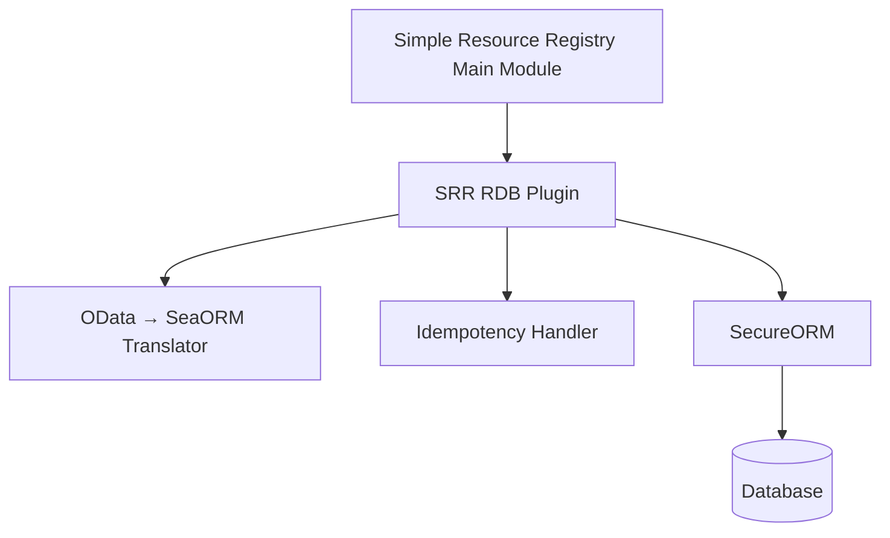
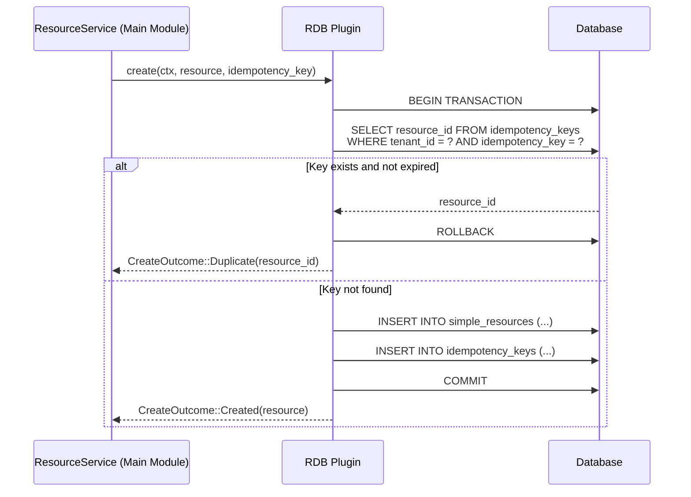
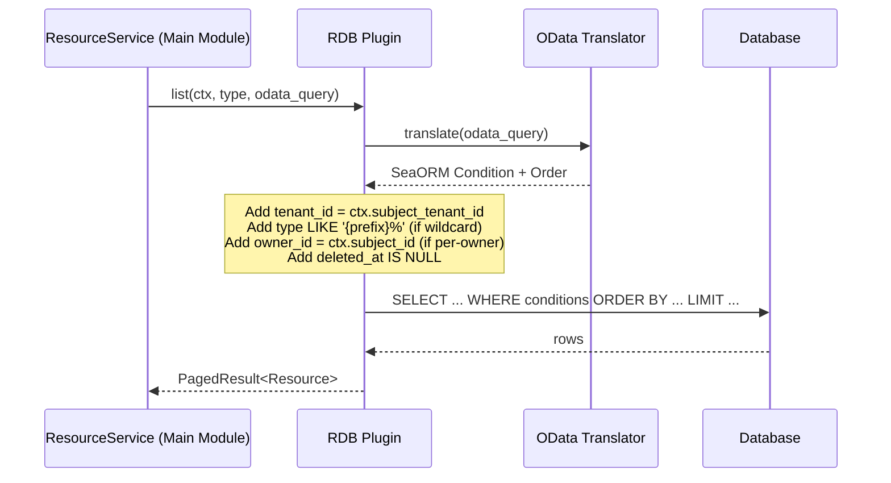
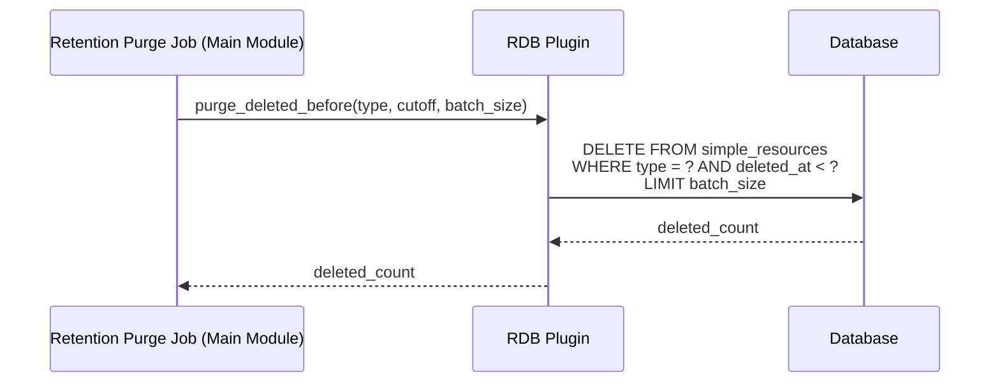

# Technical Design — SRR Relational Database Plugin

## 1. Architecture Overview

### 1.1 Architectural Vision

The SRR Relational Database Plugin is the default storage backend for the Simple Resource Registry. It implements the `ResourceStoragePluginClient` trait defined in the `simple-resource-registry-sdk` crate, providing relational database persistence via SecureORM (SeaORM + SecurityContext-based tenant scoping).

The plugin uses a **single shared table** (`simple_resources`) for all resource types (see ADR `cpt-cf-srr-rdb-adr-storage-optimization`). Schema envelope fields (id, tenant_id, owner_id, type, timestamps) are stored as dedicated indexed columns; the type-specific payload is stored as serialized JSON in a TEXT column (see ADR `cpt-cf-srr-rdb-adr-payload-storage-text`). This design keeps the storage model simple, avoids per-type table proliferation, and relies on B-tree indexes for query performance — sufficient for the target scale of 100M total resources.

Idempotency deduplication is handled atomically within a single database transaction: the plugin checks the `idempotency_keys` table and inserts both the resource row and the idempotency record in one transaction.

### 1.2 Architecture Drivers

#### Functional Drivers

| Requirement | Design Response |
| --- | --- |
| `cpt-cf-srr-rdb-fr-relational-storage` | SeaORM entity with dedicated columns for schema fields + TEXT column for serialized JSON payload; SecureORM for tenant scoping; declares `odata_support` capability |
| `cpt-cf-srr-rdb-fr-odata-translation` | OData $filter/$orderby translated to SeaORM `Condition` and `Order` on schema columns; cursor-based pagination via `id > cursor_id` predicate |
| `cpt-cf-srr-rdb-fr-gts-wildcard` | Trailing `*` in type filter → SQL `LIKE '{prefix}%'`; prefix derived by stripping `*` from the GTS pattern |
| `cpt-cf-srr-rdb-fr-idempotency` | Single-transaction: `INSERT INTO idempotency_keys ... ON CONFLICT DO NOTHING` + conditional resource insert; returns `CreateOutcome::Duplicate` if key exists |
| `cpt-cf-srr-rdb-fr-soft-delete` | `UPDATE simple_resources SET deleted_at = now() WHERE id = ? AND tenant_id = ?`; list queries include `WHERE deleted_at IS NULL` |
| `cpt-cf-srr-rdb-fr-retention-purge` | `DELETE FROM simple_resources WHERE type = ? AND deleted_at < ? LIMIT ?` |
| `cpt-cf-srr-rdb-fr-group-memberships` | Junction table `simple_resource_group_memberships` with `(id, group_id)` PK |
| `cpt-cf-srr-rdb-fr-db-agnostic` | SeaORM-based implementation behaves consistently across PostgreSQL, MariaDB, and SQLite |

#### NFR Allocation

| NFR ID | NFR Summary | Allocated To | Design Response | Verification Approach |
| --- | --- | --- | --- | --- |
| `cpt-cf-srr-rdb-nfr-scalability` | 100M resources; 100 writes/s; 1000 reads-by-ID/s | Database indexes | Composite B-tree indexes on `(tenant_id, type)`, `(tenant_id, owner_id)`, `(tenant_id, type, created_at)`; PK lookup for reads-by-ID | Load test with sustained throughput |
| `cpt-cf-srr-rdb-nfr-read-latency` | Single-resource GET < 50ms p95 | Database PK index | Primary key lookup on UUID; no joins; connection pooling via modkit-db | Load test with p95 measurement |

### 1.3 Architecture Layers

```
┌──────────────────────────────────────────────────────────┐
│              Plugin Entry Point                          │
│   ClientHub registration, PluginCapabilities             │
├──────────────────────────────────────────────────────────┤
│              Storage Implementation                      │
│   ResourceStoragePluginClient trait methods               │
│   OData → SeaORM translation, GTS wildcard → LIKE        │
├──────────────────────────────────────────────────────────┤
│              SecureORM / SeaORM                           │
│   Tenant-scoped queries, connection pooling              │
├──────────────────────────────────────────────────────────┤
│              Database                                    │
│   PostgreSQL │ MariaDB │ SQLite                          │
└──────────────────────────────────────────────────────────┘
```

| Layer | Responsibility | Technology |
| --- | --- | --- |
| Plugin Entry Point | GTS instance registration, ClientHub scoped client, capability declaration | modkit plugin lifecycle |
| Storage Implementation | CRUD operations, OData translation, wildcard matching, idempotency, soft-delete/hard-delete | Rust async, `ResourceStoragePluginClient` trait |
| SecureORM / SeaORM | Tenant-scoped query execution, ORM mapping, connection pooling | modkit-db (SecureORM), SeaORM |
| Database | Physical storage, indexes, transactions | PostgreSQL, MariaDB, or SQLite |

## 2. Principles & Constraints

### 2.1 Design Principles

#### Single-Table Storage

- [ ] `p1` - **ID**: `cpt-cf-srr-rdb-principle-single-table`

**ADRs**: `cpt-cf-srr-rdb-adr-storage-optimization`

All resource types share a single database table (`simple_resources`). This simplifies migrations, avoids DDL operations at runtime, and keeps the plugin portable across PostgreSQL, MariaDB, and SQLite. Query performance is achieved through B-tree indexes on schema fields, which are sufficient for the target scale of 100M resources.

#### Index-Based Performance

- [ ] `p1` - **ID**: `cpt-cf-srr-rdb-principle-index-performance`

**ADRs**: `cpt-cf-srr-rdb-adr-storage-optimization`

The plugin relies exclusively on B-tree indexes for query performance. No database-specific optimizations (partitioning, materialized views, partial indexes beyond soft-delete filtering) are used. This ensures the plugin works identically across all supported databases.

#### Opaque Payload

- [ ] `p1` - **ID**: `cpt-cf-srr-rdb-principle-opaque-payload`

The JSON payload column is treated as an opaque blob. The plugin does not index, query, or validate payload contents — that responsibility belongs to the main module's domain layer (schema validation) and to search-capable backends (payload querying).

### 2.2 Constraints

#### No Database-Specific Features

- [ ] `p1` - **ID**: `cpt-cf-srr-rdb-constraint-no-db-specific`

**ADRs**: `cpt-cf-srr-rdb-adr-storage-optimization`

The plugin **MUST NOT** use database-specific features such as table partitioning, PostgreSQL-specific JSON operators, or MariaDB-specific syntax.

#### No Runtime DDL

- [ ] `p1` - **ID**: `cpt-cf-srr-rdb-constraint-no-runtime-ddl`

**ADRs**: `cpt-cf-srr-rdb-adr-storage-optimization`

The plugin **MUST NOT** execute DDL operations (CREATE TABLE, ALTER TABLE) at runtime. All tables and indexes are created during database migration, before the plugin starts. This rules out per-resource-type dedicated tables, which would require DDL when new resource types are registered.

## 3. Technical Architecture

### 3.1 Domain Model

**Technology**: SeaORM entities, Rust structs

The plugin maps the logical `Resource` entity (defined in the main module's domain layer) to a SeaORM entity backed by the `simple_resources` table.

**SeaORM Entity** (conceptual):

```rust
use sea_orm::entity::prelude::*;

#[derive(Clone, Debug, PartialEq, DeriveEntityModel)]
#[sea_orm(table_name = "simple_resources")]
pub struct Model {
    #[sea_orm(primary_key, auto_increment = false)]
    pub id: Uuid,
    pub r#type: String,
    pub tenant_id: Uuid,
    pub owner_id: Option<Uuid>,
    pub created_at: DateTimeWithTimeZone,
    pub updated_at: DateTimeWithTimeZone,
    pub deleted_at: Option<DateTimeWithTimeZone>,
    pub payload: String,  // serialized JSON payload stored as TEXT
}
```

### 3.2 Component Model



**Components**:

- [ ] `p1` - **ID**: `cpt-cf-srr-rdb-component-plugin`

  - **Plugin Entry Point**: Implements `ResourceStoragePluginClient`. Registers as a scoped client in ClientHub with GTS instance ID `gts.x.core.modkit.plugin.v1~x.cf.simple_resource_registry.plugin.v1~x.core._.relational_db.v1`. Declares `PluginCapabilities { odata_support: true, search_support: false }`.

- [ ] `p1` - **ID**: `cpt-cf-srr-rdb-component-odata-translator`

  - **OData → SeaORM Translator**: Converts OData $filter expressions to SeaORM `Condition` trees and $orderby to `Order` clauses. Supports schema fields only (id, tenant_id, owner_id, type, created_at, updated_at, deleted_at). GTS wildcard type filters are translated to SQL `LIKE` prefix matches.

- [ ] `p1` - **ID**: `cpt-cf-srr-rdb-component-idempotency-handler`

  - **Idempotency Handler**: Manages the `idempotency_keys` table within create transactions. Performs atomic check-and-insert: queries for existing `(tenant_id, idempotency_key)`, and if not found, inserts both the resource row and the idempotency record in the same transaction.

### 3.3 API Contracts

This plugin has no external API — it implements the `ResourceStoragePluginClient` trait defined in the parent module's SDK crate. See the parent module's [DESIGN.md §3.2](../../../docs/DESIGN.md) for the trait definition.

### 3.4 Interactions & Sequences

#### Create with Idempotency

**ID**: `cpt-cf-srr-rdb-seq-create`



#### List with OData + GTS Wildcard

**ID**: `cpt-cf-srr-rdb-seq-list`



#### Retention Purge

**ID**: `cpt-cf-srr-rdb-seq-purge`



### 3.5 Database Schemas & Tables

#### Table: simple_resources

**ID**: `cpt-cf-srr-rdb-dbtable-simple-resources`

**Schema**:

| Column | Type | Nullable | Description |
| --- | --- | --- | --- |
| id | UUID | NOT NULL | Primary key, system-generated |
| type | VARCHAR(512) | NOT NULL | GTS type identifier for this resource |
| tenant_id | UUID | NOT NULL | Resource Tenant owner (from `SecurityContext.subject_tenant_id`) |
| owner_id | UUID | NULL | Resource Subject owner (from `SecurityContext.subject_id`, set when `is_per_owner_resource=true`) |
| created_at | TIMESTAMP WITH TIME ZONE | NOT NULL | Creation timestamp |
| updated_at | TIMESTAMP WITH TIME ZONE | NOT NULL | Last update timestamp |
| deleted_at | TIMESTAMP WITH TIME ZONE | NULL | Soft-delete timestamp (NULL = active) |
| payload | TEXT | NOT NULL | Type-specific serialized JSON payload |

**PK**: `id`

**Indexes**:

- `idx_simple_resources_tenant` — `(tenant_id)` — Required for tenant-scoped queries
- `idx_simple_resources_tenant_type` — `(tenant_id, type)` — Primary query pattern: list resources of a type within a tenant
- `idx_simple_resources_tenant_user` — `(tenant_id, owner_id)` WHERE `owner_id IS NOT NULL` — For user-scoped resource queries
- `idx_simple_resources_tenant_type_created` — `(tenant_id, type, created_at)` — For OData $orderby on created_at within a type
- `idx_simple_resources_tenant_deleted` — `(tenant_id, deleted_at)` — For filtering out soft-deleted resources
- `idx_simple_resources_type_deleted` — `(type, deleted_at)` WHERE `deleted_at IS NOT NULL` — For retention purge job queries

**Constraints**:

- `tenant_id` is NOT NULL (mandatory tenant isolation)
- `payload` is NOT NULL (empty JSON `{}` is valid but NULL is not)
- `created_at` and `updated_at` are NOT NULL and system-managed

**Example**:

| id | type | tenant_id | owner_id | created_at | updated_at | deleted_at | payload |
| --- | --- | --- | --- | --- | --- | --- | --- |
| 550e8400-... | gts.x.core.srr.resource.v1~acme.crm.\_.contact.v1~ | a1b2c3d4-... | NULL | 2026-02-16T10:00:00Z | 2026-02-16T10:00:00Z | NULL | {"name": "Jane", "email": "jane@example.com"} |
| 660f9500-... | gts.x.core.srr.resource.v1~acme.crm.\_.note.v1~ | a1b2c3d4-... | b5c6d7e8-... | 2026-02-16T09:30:00Z | 2026-02-16T11:00:00Z | NULL | {"text": "Follow up on meeting"} |

#### Table: simple_resource_group_memberships (`cpt-cf-srr-rdb-fr-group-memberships`)

**ID**: `cpt-cf-srr-rdb-dbtable-group-memberships`

**Schema**:

| Column | Type | Nullable | Description |
| --- | --- | --- | --- |
| id | UUID | NOT NULL | FK → simple_resources.id |
| group_id | UUID | NOT NULL | Resource group identifier |
| tenant_id | UUID | NOT NULL | Tenant owner (denormalized for scoping) |

**PK**: `(id, group_id)`

**Indexes**:

- `idx_group_memberships_group_tenant` — `(group_id, tenant_id)` — List all resources in a group within a tenant
- `idx_group_memberships_resource` — `(id)` — List all groups a resource belongs to

**Constraints**:

- `id` references `simple_resources(id)` ON DELETE CASCADE
- `tenant_id` is NOT NULL (mandatory tenant isolation)

#### Table: idempotency_keys (`cpt-cf-srr-rdb-fr-idempotency`)

**ID**: `cpt-cf-srr-rdb-dbtable-idempotency-keys`

**Purpose**: Deduplication store for POST create operations. `idempotency_key` is required on every create request; the plugin atomically checks this table and inserts the resource + idempotency record in one transaction. If a matching `(tenant_id, idempotency_key)` row exists and is within the retention window, the plugin returns `CreateOutcome::Duplicate` and the main module returns 409 with the `resource_id` of the previously created resource.

**Schema**:

| Column | Type | Nullable | Description |
| --- | --- | --- | --- |
| tenant_id | UUID | NOT NULL | Tenant scope (from `SecurityContext.subject_tenant_id`) |
| idempotency_key | VARCHAR(255) | NOT NULL | Caller-supplied deduplication key |
| resource_id | UUID | NOT NULL | ID of the resource created on the first successful request |
| created_at | TIMESTAMP WITH TIME ZONE | NOT NULL | When the idempotency record was stored |
| expires_at | TIMESTAMP WITH TIME ZONE | NOT NULL | When this record is eligible for purge (default: created_at + 24 h) |

**PK**: `(tenant_id, idempotency_key)`

**Indexes**:

- `idx_srr_idem_expires` — `(expires_at)` — For periodic purge of expired records

**Constraints**:

- `tenant_id` is NOT NULL (mandatory tenant scoping — same key in different tenants is distinct)
- `idempotency_key` max length 255 chars
- `resource_id` references `simple_resources(id)` ON DELETE CASCADE
- Records **MUST** be purged after `expires_at` by a background job (same Jobs Manager job as retention purge, or a dedicated lightweight task)

### 3.6 Indexing Strategy

The indexing strategy is designed to support the primary query patterns at scale (100M resources) without requiring table partitioning or database-specific features:

| Query Pattern | Index Used | Expected Performance at 100M |
| --- | --- | --- |
| Fetch by ID (PK lookup) | `PRIMARY KEY (id)` | O(log n) B-tree lookup; < 10ms |
| List by type within tenant | `idx_simple_resources_tenant_type` | Composite index narrows to type partition within tenant; efficient for up to ~1M per type |
| List by type ordered by created_at | `idx_simple_resources_tenant_type_created` | Covers the full query without table lookups |
| Filter soft-deleted resources | `idx_simple_resources_tenant_deleted` | Partial index on active records (deleted_at IS NULL) |
| Retention purge by type + deleted_at | `idx_simple_resources_type_deleted` | Partial index on deleted records only — small index size |
| User-scoped queries | `idx_simple_resources_tenant_user` | Partial index on rows with owner_id; avoids indexing tenant-only resources |

See [ADR-0001: Storage Optimization](./ADR/0001-cpt-cf-srr-rdb-adr-storage-optimization.md) for the rationale behind choosing indexes over partitioning or per-type tables.

## 4. Additional Context

### 4.1 Known Design-Level Limitations

1. **No payload querying**: The payload column is opaque serialized JSON. The plugin cannot filter or index payload content. For payload-level queries, use a search-capable backend.

2. **SQLite concurrency**: SQLite uses file-level locking, which limits concurrent write throughput. The 100 writes/s target may not be achievable on SQLite under high concurrency. SQLite is intended for edge/dev environments with lower concurrency requirements; production deployments should use PostgreSQL.

3. **Single-table contention**: Under extreme write loads, the single `simple_resources` table may experience lock contention. This is mitigated by the row-level locking available in PostgreSQL and MariaDB. If contention becomes an issue, the main module's storage routing can redirect high-write types to a dedicated backend.

4. **Idempotency key expiration**: Expired idempotency records are purged by a background job. Between expiration and purge, the record still occupies space but is no longer enforced (the deduplication check uses `WHERE expires_at > now()`).

## 5. Traceability

- **Parent Module PRD**: [../../../docs/PRD.md](../../../docs/PRD.md)
- **Parent Module DESIGN**: [../../../docs/DESIGN.md](../../../docs/DESIGN.md)
- **Plugin PRD**: [PRD.md](./PRD.md)
- **ADRs**: [ADR/](./ADR/)
